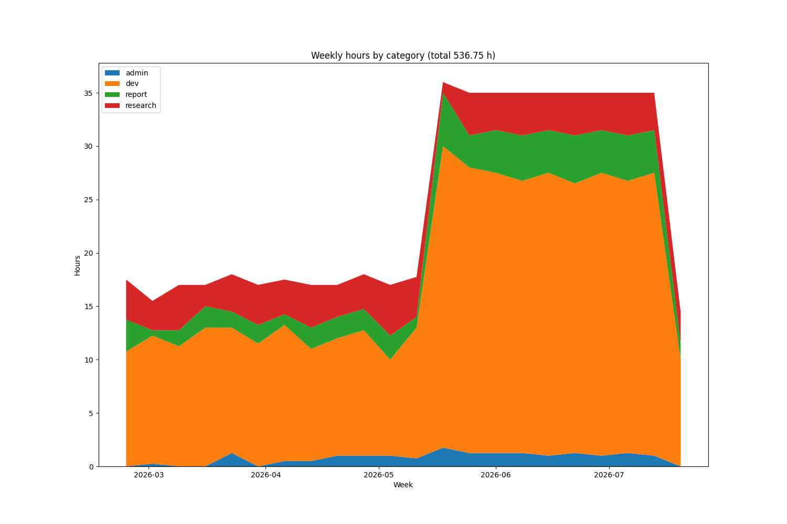

# Work journal tool

Python script to validate a work journal and visualize it.

It accepts the following journal format
```csv
start, end, category, description
23.02.2026 09:00, 23.02.2026 10:00, dev, unit tests
```

It will validate that
* each start time is before the end time
* there are no overlapping entries

Usage
```bash
./main.py work_journal.csv work_journal.png
```

Example output
